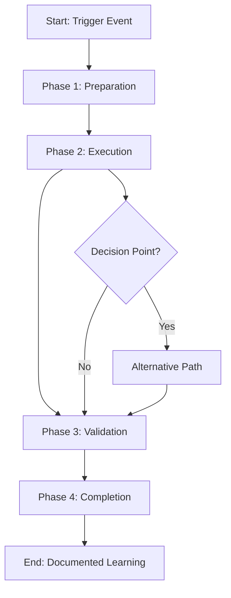

# [Playbook Title]: [Brief Objective]

**Version:** 1.0  
**Owner:** [Name/Team]  
**Last Updated:** YYYY-MM-DD  
**Scope:** [Individual | Team | Organization-wide]  
**Status:** [Active | Draft | Archived]

---

## Overview

**Objective:** [Clear statement of what this playbook accomplishes]

**Use this playbook when:** [Describe the situations where this playbook applies]

**Expected Duration:** [Approximate time to complete]

**Key Stakeholders:**
- [Role 1]
- [Role 2]
- [Role 3]

---

## Playbook Purpose

### What Problem Does This Solve?

Explain the business problem or operational need this playbook addresses:
- What challenge does it help teams overcome?
- What outcome are we trying to achieve?
- Who benefits from this playbook?

### Expected Outcomes

After following this playbook, you should have:
- Outcome 1: [Specific deliverable]
- Outcome 2: [Specific deliverable]
- Outcome 3: [Specific deliverable]

### Success Criteria

This playbook is successful when:
- [ ] Criterion 1: [How you'll know it's successful]
- [ ] Criterion 2: [Measurable outcome]
- [ ] Criterion 3: [Observable result]

---

## Workflow Diagram



---

## Phase 1: Preparation

### Prerequisites

**Before starting, ensure you have:**
- [ ] Requirement 1: [Description]
- [ ] Requirement 2: [Description]
- [ ] Requirement 3: [Description]

**Required Access/Permissions:**
- [ ] [Access 1]
- [ ] [Access 2]

**Required Tools:**
- [Tool 1] - [Installation/Access instructions]
- [Tool 2] - [Installation/Access instructions]

### Planning & Setup

#### Step 1: [Preparation Task 1]
**Objective:** [What are you trying to accomplish?]

- Action 1: [Specific task]
- Action 2: [Specific task]
- Action 3: [Specific task]

**Verification:** How do you confirm this is complete?
- [ ] Confirmation 1
- [ ] Confirmation 2

**Estimated Time:** [X minutes/hours]

#### Step 2: [Preparation Task 2]
**Objective:** [What are you trying to accomplish?]

**Actions:**
1. [Numbered action]
2. [Numbered action]
3. [Numbered action]

**Checklist:**
- [ ] Item 1
- [ ] Item 2
- [ ] Item 3

**Estimated Time:** [X minutes/hours]

#### Step 3: [Preparation Task 3]

- [ ] [Action to complete]
- [ ] [Action to complete]
- [ ] [Action to complete]

### Communication & Notification

**Who needs to be informed?**
- [Role 1]: [What communication and when?]
- [Role 2]: [What communication and when?]

**Communication Template:**
```
Subject: [Standard subject line]

[Standard notification template]
```

**Timeline:**
- T-[X hours]: [Initial notification]
- T-0: [Start notification]
- T+[X hours]: [Completion notification]

---

## Phase 2: Execution

### Main Workflow

#### Step 1: [Execution Action 1]
**Objective:** [Specific goal for this step]

**Actions:**
```
1. [First action]
   - Sub-action 1
   - Sub-action 2
2. [Second action]
   - Sub-action 1
   - Sub-action 2
3. [Third action]
```

**Decision Point:** [If applicable]
- IF [Condition A]: Continue to Step 2
- IF [Condition B]: Execute Alternative Path (Section: [Reference])
- IF [Condition C]: Escalate to [Owner]

**Verification:**
- [ ] Verify 1: [How to check this succeeded]
- [ ] Verify 2: [How to check this succeeded]

**Troubleshooting:**
- **Problem:** [Issue might occur]
  - **Solution:** [How to resolve]
- **Problem:** [Issue might occur]
  - **Solution:** [How to resolve]

**Estimated Time:** [X hours]

**Owner:** [Who executes this step]

#### Step 2: [Execution Action 2]

**Objective:** [What are we trying to accomplish?]

**Actions:**
- [ ] Action 1
- [ ] Action 2
- [ ] Action 3

**Parallel Activities:** [If others can work simultaneously]
- [Team A] completes: [Task]
- [Team B] completes: [Task]

**Synchronization Point:** [When different tracks converge]
- Confirm all teams have completed their portions
- Verify integration points
- Address any conflicts

**Estimated Time:** [X hours]

#### Step 3: [Execution Action 3]

**Objective:** [Specific goal]

**Process:**
1. [Step 1]
2. [Step 2]
3. [Step 3]

**Quality Checks:**
- [ ] Check 1: [Quality criterion]
- [ ] Check 2: [Quality criterion]
- [ ] Check 3: [Quality criterion]

**Estimated Time:** [X hours]

### Communication During Execution

**Progress Updates:**
- Every [X hours]: Update [Stakeholder] on status
- On completion of each phase: Notify [Stakeholder]
- On any issues: Immediately notify [Escalation Contact]

**Status Report Template:**
```
Phase: [Current phase]
Progress: [X% complete]
Completed: [List completed items]
In Progress: [What's currently happening]
Next Steps: [What's coming next]
Issues: [Any blockers or concerns]
ETA: [Estimated completion time]
```

---

## Phase 3: Validation

### Testing & Verification

#### Validation Task 1: [Type of Validation]
**Objective:** [What are we verifying?]

**Test Cases:**
1. Test Case 1: [Scenario]
   - Expected Result: [What should happen]
   - Actual Result: [What happened]
   - Status: [ ] Pass / [ ] Fail

2. Test Case 2: [Scenario]
   - Expected Result: [What should happen]
   - Actual Result: [What happened]
   - Status: [ ] Pass / [ ] Fail

**Acceptance Criteria:**
- [ ] Criterion 1: [Requirement]
- [ ] Criterion 2: [Requirement]
- [ ] Criterion 3: [Requirement]

**Sign-off:**
- Validator: [Name]
- Date: YYYY-MM-DD
- Approved: [ ] Yes [ ] No

#### Validation Task 2: [Type of Validation]

**Validation Steps:**
- [ ] Step 1
- [ ] Step 2
- [ ] Step 3

**Success Indicators:**
- [ ] Indicator 1
- [ ] Indicator 2
- [ ] Indicator 3

### Rollback Plan (If Validation Fails)

**If validation reveals critical issues:**

1. **Halt Phase 3** - Stop all further actions
2. **Notify Stakeholders** - Alert decision makers immediately
3. **Analyze Issues** - Understand what went wrong
4. **Decide Path Forward:**
   - [ ] Remediate issues and re-validate
   - [ ] Rollback to previous state
   - [ ] Escalate to leadership

**Rollback Steps:**
1. [Rollback action 1]
2. [Rollback action 2]
3. [Rollback action 3]

**Rollback Estimated Time:** [X hours]

---

## Phase 4: Completion

### Finalization Tasks

#### Task 1: [Completion Task]
- [ ] [Action 1]
- [ ] [Action 2]
- [ ] [Action 3]

#### Task 2: [Completion Task]
- [ ] [Action 1]
- [ ] [Action 2]

### Knowledge Capture

**Document:**
- [ ] What went well
- [ ] What could be improved
- [ ] Lessons learned
- [ ] Key decisions made
- [ ] Outstanding items for follow-up

**Lesson Learned Template:**
```
[Topic]: [Specific learning]
- Context: [When/why this mattered]
- Insight: [What we learned]
- Application: [How we'll use this in future]
```

### Closure & Communication

**Final Notification:**
```
Subject: [Playbook] - Completion Notification

[Stakeholders],

The [Playbook Name] workflow has been completed successfully.

Completion Summary:
- Objective: [Achieved/Not achieved]
- Timeline: [Actual vs planned]
- Quality: [Assessment]
- Next Steps: [What happens next]

[Additional details as needed]

[Name]
[Title]
```

**Archival:**
- [ ] Document final status
- [ ] Archive all supporting materials
- [ ] Update tracking systems
- [ ] Close any associated tickets/issues

---

## Alternative Paths

### Alternative Path 1: [Scenario]

**When to use:** [Conditions that trigger this path]

**Execution:**
1. [Step 1]
2. [Step 2]
3. [Rejoin main workflow at Step X]

**Estimated Time:** [Duration]

### Alternative Path 2: [Scenario]

**When to use:** [Conditions that trigger this path]

**Execution:**
- Step 1
- Step 2
- Rejoins at: [Location in main workflow]

---

## Decision Matrix

| Decision Point | Option A | Option B | Option C | Recommendation |
|---|---|---|---|---|
| Scenario 1 | [Choice A] | [Choice B] | [Choice C] | [Recommended] |
| Scenario 2 | [Choice A] | [Choice B] | [Choice C] | [Recommended] |
| Scenario 3 | [Choice A] | [Choice B] | [Choice C] | [Recommended] |

---

## Roles & Responsibilities

| Role | Responsibilities | Contact |
|------|---|---|
| **[Role 1]** | <ul><li>Responsibility 1</li><li>Responsibility 2</li></ul> | [Contact info] |
| **[Role 2]** | <ul><li>Responsibility 1</li><li>Responsibility 2</li></ul> | [Contact info] |
| **[Role 3]** | <ul><li>Responsibility 1</li><li>Responsibility 2</li></ul> | [Contact info] |

### Escalation Path

**Level 1 (Issues):** Contact [Name/Role]  
**Level 2 (Decisions):** Contact [Name/Role]  
**Level 3 (Critical):** Contact [Name/Role]  

---

## Timeline & Scheduling

### Standard Timeline

| Phase | Duration | Notes |
|-------|----------|-------|
| Preparation | [X hours/days] | Can be done in parallel |
| Execution | [X hours/days] | Critical path item |
| Validation | [X hours/days] | Dependent on execution |
| Completion | [X hours/days] | Should be quick |
| **Total** | **[X hours/days]** | **Standard estimate** |

### Example Scheduling

**Monday:**
- 9:00 AM - Phase 1 Kickoff
- 11:00 AM - Phase 1 Complete
- 1:00 PM - Phase 2 Begins

**Tuesday:**
- All day - Phase 2 Execution
- 5:00 PM - Phase 2 Complete

**Wednesday:**
- 9:00 AM - Phase 3 Validation
- 12:00 PM - Validation Complete
- 1:00 PM - Phase 4 Completion

---

## Tools & Resources

**Required Tools:**
- [Tool 1](link) - Purpose
- [Tool 2](link) - Purpose

**Templates:**
- [Template 1](link) - Used in Phase X
- [Template 2](link) - Used in Phase Y

**Documentation:**
- [Reference 1](link)
- [Reference 2](link)

**Related Playbooks:**
- [Playbook A] - Prerequisite playbook
- [Playbook B] - Related workflow

---

## FAQ

**Q: What if we don't complete Phase X by the scheduled time?**
A: [Answer with guidance]

**Q: Can we skip any steps?**
A: [Answer explaining which steps are critical vs optional]

**Q: Who approves moving between phases?**
A: [Answer with approval chain]

---

## Governance

**Owner:** [Name/Team]  
**Last Reviewed:** YYYY-MM-DD  
**Next Review:** YYYY-MM-DD  
**Approval:** [CTO/Platform Owner]  

**Version History:**
| Version | Date | Changes |
|---------|------|---------|
| 1.0 | YYYY-MM-DD | Initial version |

---

**Template Version:** 1.0  
**Platform:** Knowledge Management Platform  
**Owner:** Muhammad Shaheer Nawaz

*This playbook is living documentation. Share feedback and improvements as you use it.*
